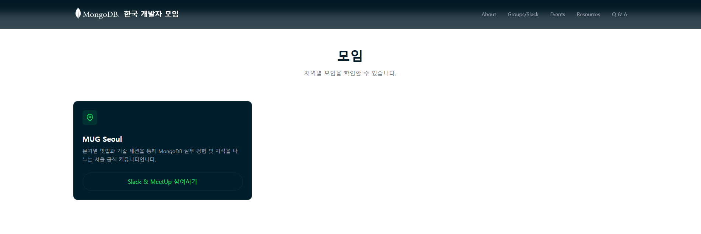
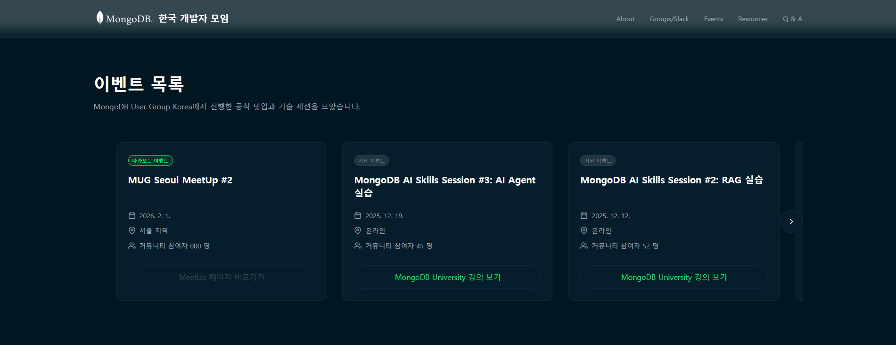
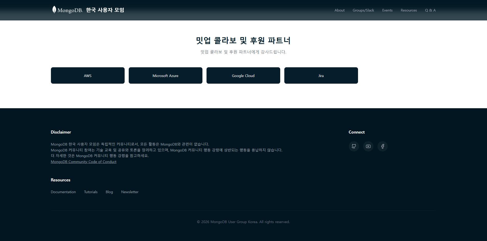

# MongoDB 한국 개발자 모임 (MongoDB Developers KR) 홈페이지 (Draft)

MongoDB 한국 개발자 모임의 공식 홈페이지(Draft)입니다.

- 현재는 가안(Draft)만 생성된 상태로, 프로젝트 구성 규칙, 활용 라이브러리, 사용성은 향후 참여자 분들의 활동이 반영되면 변경될 수 있음을 알려드립니다.

## 페이지 미리보기

### 1. 헤더 및 히어로 섹션


- **고정 헤더**: MongoDB 한국 개발자 모임 로고와 네비게이션 메뉴
- **히어로 섹션**: MongoDB 한국 개발자 모임 소개 및 Slack 채널 참여 버튼
- **통계 섹션**: 회원 수 및 이벤트 정보

### 2. 모임 및 그룹 섹션



- **모임 섹션**: 지역별 모임 정보 (현재 서울 지역 모임 운영 중)
- 각 모임의 설명과 참여 인원 정보 제공

### 3. 이벤트 섹션



- **이벤트 목록**: 다가오는 이벤트와 지난 이벤트 정보
- 각 이벤트의 날짜, 장소, 참여 인원 정보 제공
- MongoDB University 링크 제공

### 4. 파트너 및 푸터 섹션



- **파트너 & 스폰서**: 커뮤니티를 지원하는 파트너사 소개 (예시)
- **푸터**:
  - Disclaimer: 커뮤니티 독립성 및 행동 강령 안내 (예시)
  - Resources: 문서, 튜토리얼, 블로그, 뉴스레터 링크 (예시)
  - Connect: GitHub Slack 등 소셜 미디어 링크 (예시)
    공

## 기술 스택

> (스타일링, 아이콘 등에 사용되는 라이브러리는 변경될 수 있습니다.)

- **프레임워크**: React 19
- **빌드 도구**: Vite
- **스타일링**: Tailwind CSS
- **아이콘**: Lucide React
- **아키텍처**: Feature-Sliced Design (FSD)
- **패키지 매니저**: pnpm

## 프로젝트 구조

(앞으로 변경될 수 있습니다.)

```
src/
├── app/              # 앱 설정 및 전역 스타일
├── pages/            # 페이지 컴포넌트
│   └── landing/      # 랜딩 페이지
├── widgets/          # 독립적인 UI 블록
│   ├── Header/       # 헤더 위젯
│   ├── Hero/         # 히어로 섹션
│   ├── Stats/        # 통계 섹션
│   ├── Groups/       # 모임 섹션
│   ├── Events/       # 이벤트 섹션
│   ├── Partners/     # 파트너 섹션
│   └── Footer/       # 푸터
├── shared/           # 공통 컴포넌트 및 유틸리티
│   ├── ui/           # UI 컴포넌트 (Button, Card 등)
│   └── lib/          # 유틸리티 함수
└── main.tsx          # 앱 진입점
```

## 시작하기

### 설치

```bash
pnpm install
```

### 개발 서버 실행

```bash
pnpm dev
```

개발 서버가 실행되면 브라우저에서 `http://localhost:5173`으로 접속할 수 있습니다.

### 빌드

```bash
pnpm build
```

### 미리보기

```bash
pnpm preview
```

## 주요 기능 (구상중, Draft 버전에서 고려한 내용만 포함하고 있습니다.)

- 반응형 디자인 (모바일, 태블릿, 데스크탑 지원)
- 다크 테마 기반 UI
- MongoDB 브랜드 컬러 적용
- 소셜 미디어 링크 통합
- 이벤트 정보 관리
- 모임 및 그룹 정보 제공

## 🤝 기여하기

MongoDB 한국 개발자 모임은 오픈소스 커뮤니티입니다. 기여를 환영합니다!

1. 이 저장소를 포크하세요
2. 새로운 기능 브랜치를 생성하세요 (`git checkout -b feature/AmazingFeature`)
3. 변경사항을 커밋하세요 (`git commit -m 'Add some AmazingFeature'`)
4. 브랜치에 푸시하세요 (`git push origin feature/AmazingFeature`)
5. Pull Request를 열어주세요

## 📄 라이선스

이 프로젝트는 MongoDB 한국 개발자 모임의 독립적인 커뮤니티 프로젝트입니다.

## 🔗 링크

- **GitHub Organization**: [https://github.com/MongoDB Developers KRkr/homepage](https://github.com/mongodb-developers-kr)
- **MongoDB Community Code of Conduct**: [https://www.mongodb.com/community-code-of-conduct](https://www.mongodb.com/community-code-of-conduct)

---

© 2026 MongoDB Korea Usergroup - MongoDB Developers KR Korea. All Rights Reserved.
