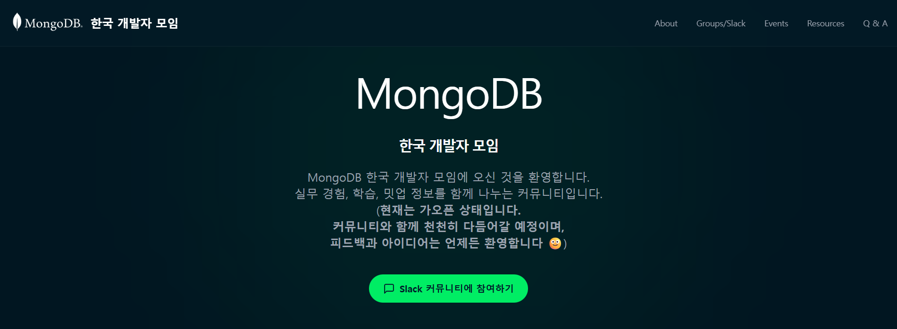
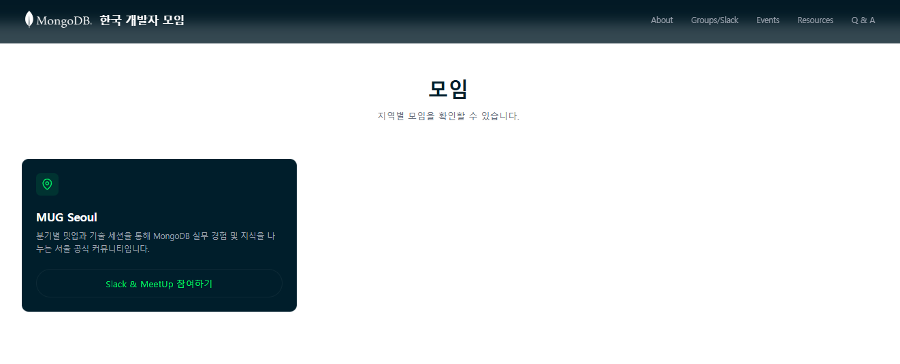
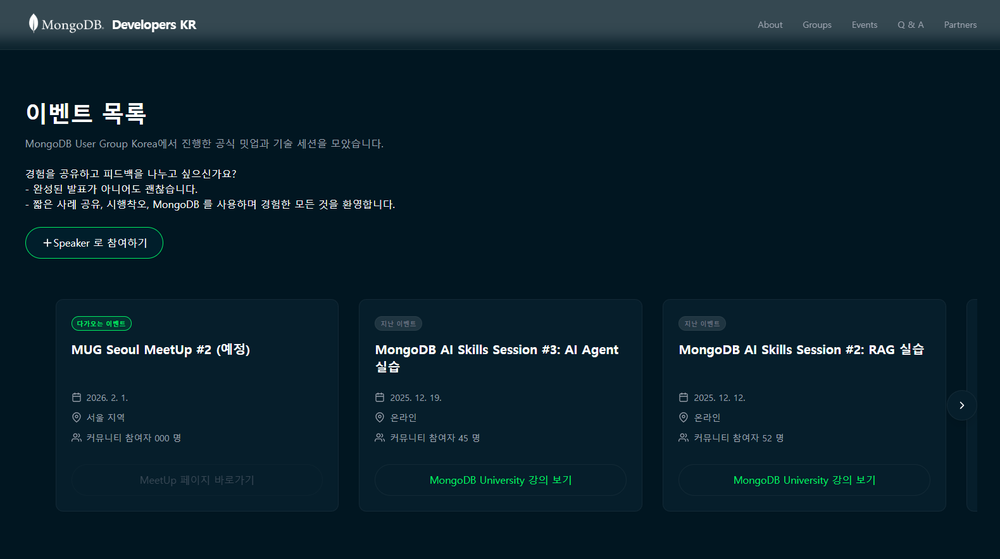
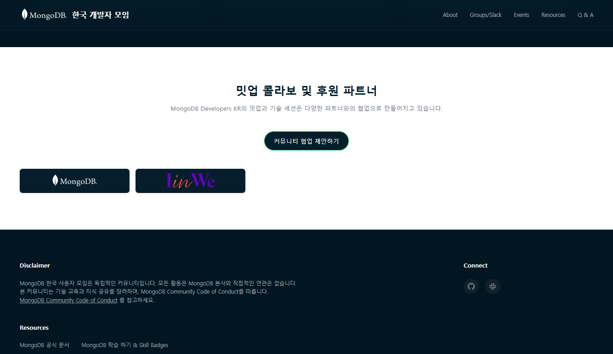

# MongoDB 한국 개발자 모임 (MongoDB Developers KR) 홈페이지

MongoDB 한국 개발자 모임의 공식 홈페이지입니다.

- 아직 다듬어가는 중인 프로젝트입니다. 프로젝트 구성 규칙, 활용 라이브러리, 사용성은 참여자 분들의 의견이 반영되면서 계속 바뀔 수 있습니다.

## 콘텐츠 수정하기 (React 를 몰라도 됩니다)

화면에 보이는 이벤트, 모임, Q&A, 파트너 정보는 모두 `content/` 폴더의 JSON 파일에 들어 있습니다.
화면 코드를 건드리지 않고 이 파일만 고쳐서 Pull Request 를 보내면 됩니다.

| 파일                    | 담는 내용                                    |
| ----------------------- | -------------------------------------------- |
| `content/site.json`     | 커뮤니티 이름, 멤버 수, 모든 외부 링크(Slack·폼·GitHub) |
| `content/events.json`   | 밋업 · 기술 세션 목록                        |
| `content/groups.json`   | 지역·주제별 모임 목록                        |
| `content/qna.json`      | 자주 묻는 질문                               |
| `content/partners.json` | 협업 · 후원 파트너                           |

각 파일의 형식은 `src/shared/content/schema.ts` 에 정의되어 있습니다.
형식이 맞지 않으면 **빌드가 실패하면서 어디가 잘못됐는지 알려줍니다.**

```
content/events.json 검증 실패
  - 0.date: YYYY-MM-DD 형식이어야 합니다
  - 1.linkLabel: link 가 있으면 linkLabel 도 있어야 합니다
```

### 이벤트 하나 추가하기

`content/events.json` 배열 맨 앞에 항목을 추가합니다.

```json
{
  "id": "mug-korea-seoul-2026-09",
  "category": "meetup",
  "type": "inPerson",
  "status": "open",
  "title": "Seoul MUG MeetUp #5",
  "date": "2026-09-24",
  "time": "19:00 ~ 21:30",
  "location": "서울 강남구",
  "description": ["다룰 주제를 한 줄에 하나씩 적어주세요"],
  "link": "https://www.meetup.com/mongodb-usergroup-seoul/events/000000000",
  "linkLabel": "Meetup 페이지 열기",
  "createdAt": "2026-08-09",
  "updatedAt": "2026-08-09"
}
```

- `status` 가 `open` 또는 `preparation` 이면 첫 화면 상단에 "다음 밋업"으로 노출됩니다.
- `linkLabel` 은 버튼에 그대로 찍히는 문구입니다. 어디로 가는 버튼인지 드러나게 적어주세요.
- 파트너 로고 이미지는 `public/partners/` 에 넣고 `content/partners.json` 에서 `partners/파일명.png` 로 참조합니다.

## 페이지 구성

### 1. 헤더 및 히어로 섹션



- **고정 헤더**: 로고와 네비게이션 (모바일에서는 햄버거 메뉴)
- **히어로 섹션**: 커뮤니티 소개, Slack 워크스페이스 가입 버튼, 다음 밋업 안내
- **통계 섹션**: 커뮤니티 멤버 수와 누적 이벤트 수

### 2. 모임 및 그룹 섹션



- 지역별 모임 정보 (현재 서울 지역 모임 운영 중)

### 3. 이벤트 섹션



- 밋업 · 기술 세션 목록과 발표 제안 창구

### 4. Q&A 섹션



- 자주 묻는 질문과 질문 창구 (폼 / Slack 채널)

### 5. 파트너 및 푸터 섹션


- 협업 · 후원 파트너, Disclaimer, Resources, Connect

## 기술 스택

- **프레임워크**: React 19
- **빌드 도구**: Vite
- **스타일링**: Tailwind CSS
- **아이콘**: React Icons
- **콘텐츠 검증**: Zod (빌드 타임)
- **아키텍처**: Feature-Sliced Design (FSD)
- **패키지 매니저**: pnpm

## 프로젝트 구조

```
content/              # 화면에 보이는 콘텐츠 (JSON)
public/               # 정적 파일 (파트너 로고, OG 이미지, 파비콘)
scripts/
└── validate-content.ts  # 빌드 시 content/ 를 스키마로 검증
src/
├── app/              # 앱 설정 및 전역 스타일
├── pages/landing/    # 랜딩 페이지
├── widgets/          # 독립적인 UI 블록 (header, hero, stats, groups, events, qna, partners, footer)
├── entities/         # 도메인 모델과 표시용 라벨
├── shared/
│   ├── content/      # content/ 로더와 스키마 정의
│   ├── ui/           # 공통 UI 컴포넌트 (Button, Card)
│   └── lib/          # 유틸리티, 스타일 토큰, API 클라이언트
└── main.tsx
```

## 시작하기

```bash
pnpm install
pnpm dev      # http://localhost:5173
pnpm build    # content/ 검증 후 docs/ 에 빌드
pnpm lint
```

`homepage-api` 없이도 동작합니다. 모임 목록은 `content/groups.json` 으로 먼저 그려지고,
API 응답이 성공했을 때만 최신 데이터로 교체됩니다.

### 환경 변수

```
VITE_CACHE_API=https://api.mugkrapi.work
```

## 기여하기

MongoDB 한국 개발자 모임은 오픈소스 커뮤니티입니다. 기여를 환영합니다.

1. 이 저장소를 포크하세요
2. 새로운 기능 브랜치를 생성하세요 (`git checkout -b feature/AmazingFeature`)
3. 변경사항을 커밋하세요 (`git commit -m 'Add some AmazingFeature'`)
4. 브랜치에 푸시하세요 (`git push origin feature/AmazingFeature`)
5. Pull Request 를 열어주세요

콘텐츠만 고치는 PR 도 똑같이 환영합니다. 오탈자 수정, 이벤트 추가, Q&A 보완 모두 좋습니다.

## 라이선스

이 프로젝트는 MongoDB 한국 개발자 모임의 독립적인 커뮤니티 프로젝트입니다.

## 링크

- **GitHub Organization**: https://github.com/mongodb-developers-kr
- **MongoDB Community Code of Conduct**: https://www.mongodb.com/community-code-of-conduct

---

© 2026 MongoDB Developers KR. All Rights Reserved.
